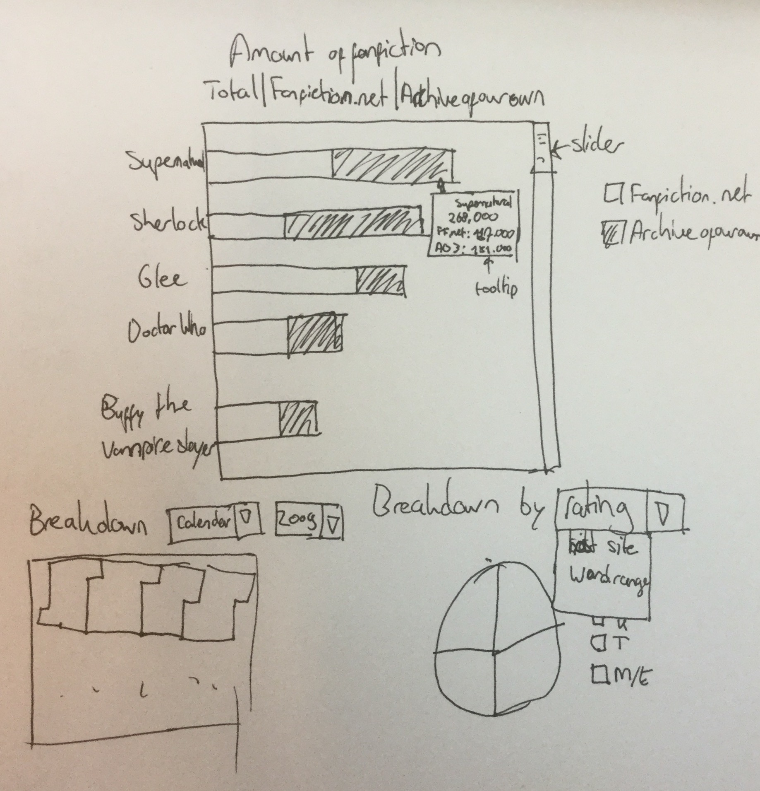

# Technical Design
### Sanne Meijering

## Sketch

## Diagram

## Obtaining Data
Data of TV series with over 50 fanfictions is scraped from Fanfiction.net (FF.net) and Archiveofourown.org (AO3). 
The titles are compared and identical titles are put together into a key-file. The key is then altered manually 
until all TV series have only one entry and reality shows and tv adaptions are removed, as FF.net does not allow 
fanfiction about real people and puts tags for adapted tv series into the page of the original format (e.g. the 
life-action version of Death Note does not differ enough from the original manga (Japanese comic) to warrant a 
new tag). Afterwards, all TV series are scraped again, without restrictions. Next, the information from both 
scrapes is fused into one JSON file using the key, during which all excluded series are discarded.

Two more scrapers scrape the date of publication, TV series, rating (age), number of words and
chapters and whether it is marked complete for every fanfiction. Data from both sites then is fused into four JSON files:
Two with the number of publication, one sorted by series, one sorted by year and two with the additional information, one
sorted by series and one sorted by year.

## Linking
### Main chart
The main chart (bar chart) initially shows a sorted list of series with the highest amount of fanfictions written 
for it. With buttons this view can be changed to show only fanfiction from FF.net or AO3.

### Calendar chart
The calendar chart (or similar) initially the amount of fanfiction publicized in the last year per day. When clicking on 
a series in the main chart, the calendar changes to show only the fanfiction publicized from the clicked series. If the 
main chart is changed with buttons, the calendar reverts back to the total amount of fanfiction. With a drop-down menu a 
year can be selected for the chart.

### Pie chart
The pie chart initially shows the distribution of age rating for all fanfiction. When clicking on a series in the main 
chart, the pie chart changes to the distribution of fanfiction rating of the clicked series. If the main chart is 
changed with buttons, the pie chart reverts back to the total amount of fanfiction. When a new year is selected from
the calendar, the pie chart also changes to show only the fanfiction of that year and of a previously clicked series. With
a drop-down menu the chart can be changed to show other information about distributions: word range, chapter range, host 
website and completion
