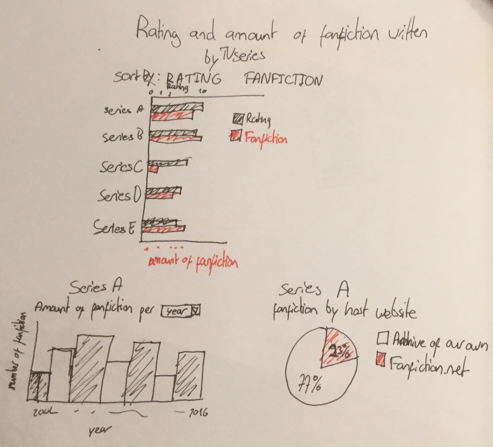
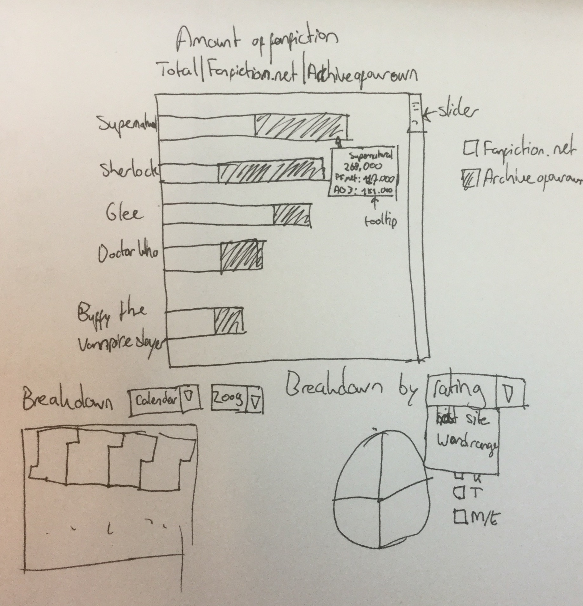
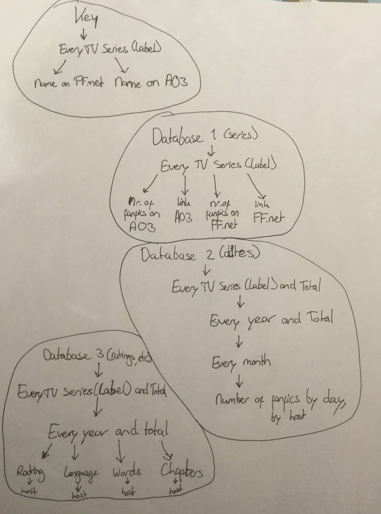

# Week 1
## Day 1
I decided on doing a visualization about fanfiction.
The visualization is going to look like this:

I might need to change one of the bar charts into a different type of graph.
Possibly a line chart for the minor bar graph.

## Day 2
I made scrapers for IMDB, Fanfiction.net and Archiveofourown. All three work, but I have trouble with the series on IMDB.
The TV series on IMDB also include anime, which are under different headers on the fanfiction sites. To solve this I also scraped the anime pages.
Another problem with IMDB is that it was around 130.000 TV series, while both fanfiction sites together might have half the number of series in all categories.

## Day 3
I decided to not use the IMDB information, as there was no way to obtain the right information without scraping all 130.000 series. Instead, I'll focus more on scraping the fanfiction sites. I might end up adding information from another site, but for now I'll keep it simple.
I made a sketch with the new layout: 

## Day 4
I started making a title key, as the same series might not be under the same title on different sites. There's a lot of series, so I thought about setting a minimum amount of fanfiction later. Removing IMDB did reduce the work a lot.
I tried making a complete key and then remove the ones that have less than 50 fanfiction, but that was still too much work, so I changed the method and now I only include tv series with over 50 stories on one site. If they have over 50 on one site and under 50 on the other, I add the name of the series on the other side to the key manually.

## Day 5
I made the HTML for the visualization, no new plans made.

# Week 2

## Day 1
I completed the key, scraped all series from both sites and then used the key to make a database. With this, the first database is complete and I can start on the second and third database, for which the information can be scraped at the same time.

## Day 2

I completed the first scraper that goes through all fanfics. Scraping whether the story was complete or incomplete turned out to be tricky due to the inconsistent format (FF.net puts in either 'complete' or no text, while AO3 shows the current number of chapters and the number of chapters the series will have when complete) , so I decided to scrape the language of the fanfic instead. Scraping all fanfiction takes some time, as expected, but it's at an acceptable level (by my calculation it will take around one hour and a half to scrape 1 million fanfics). I looked at the html of the second fanfiction site, and it looked a lot easier to scrape. As I made a seperate methods file, of which multiple methods can be used for the second scraper, I expect the second scraper to be done much faster. I also set up both the databases and made a sketch of them:

## Day 3

The first scraper had a run time of 2,5 hours. I completed the second scraper that goes through all fanfics too and ran it overnight.

## Day 4

I made a start on the bar chart. I realized the data was not in a useable format for D3, so I changed the format so that the level that has to be used by D3 is a list instead of a json/dict for database 1. I fear I'll have to scrape the fanfiction sites again for the other databases.

## Day 5

I added multiple views on the bar chart, one for each site and one total. The bar chart now shows all series, but is still not ordered by value and all bars are shown. I left out the labels for the y-axis (which has the names of the series on it) since it would only be a black mass while the bars are so thin.

# Week 3

## Day 1

Over the weekend I updated and ran the second scaper for fanfiction.net. It was still not quite the right format though, so I updated the scraper again. Today I updated the second scraper for ao3. I ran the fanfiction.net scraper over night.

## Day 2

The runtime of the FF.net scraper has increased to 3,5 hours, but the format is perfect. I also created the first version of the pie chart and improved on the bar chart to show only the top 20 series. I realize the slider I wanted to implement as an optional feature is quite important, since otherwise the series below the top 20 are completely unreachable, and I started on it. However, the slider became a 0x0 div and it just wouldn't appear.

## Day 3
Today I spent the first half of the day fighting with gitHub. All uncommited changes seemed to have become undone, but synching later suddenly restored the lost changes. In the remaining few hours I finally managed to get the slider to work correctly. I attempted to upgrade the pie chart to be linked to the buttons, but for some reason it doesn't work.

## Day 4
Today was a productive day. The problem with the data of the pie chart not updating was due to me loading the wrong database, which contained only the information from one site. I got the calendar chart up and working, though the colors are still a bit off and added events to the drop-down menus. These work perfectly.

## Day 5
I added legends to the pie chart and to the calendar chart. The colors in the pie chart keep changing though and the legend is not in the correct order. I also stumbled upon a few problems. The languages turned out to be written in English on one site and in the language itself on the other. Tying them together takes too long and the number of language causes the legend to go out of bounds all the time. I decided to remove language from the selection list Another problem was that a lot of information was missing from the ao3 site. More specifically, information from big series seems to have been cut off quite early, causing only information from the last few months to be available. I fear it's a block or something, as the scraper sends around 300 requests per minute.

# Week 4
## Day 1
Over the weekend, I replaced the data sets with updated versions without the language. I was already working on adding the missing information from ao3 by scraping one series at the time, but I found out quite early that the scraper just crashes often due to a missing value (to be specific, it seems that there are many stories without words on ao3). I fixed this and the ao3 scraper ran without a single error. I had two errors when scraping ff.net, so it's probable that two series have incomplete information. One was Lost World, but I don't remember the name of the other. Lost World crashed late in the scraping though and the other series didn't have much fanfiction anyway, so I decided to leave both as is. I had investigated these errors earlier, but unlike with ao3 I couldn't find any stories without words.
I also completed the tooltips today. The calendar chart comes with titles, so the data appears on hover without tooltips. I decided to leave that as is, since I'm running a bit short on time.

## Day 2
It was hard, but I managed to sort the pie chart and its legend and relabelled both the legend and the tooltips it says '1 chapters', but otherwise the labels are good. I started on updating the colors of the calendar chart. Though the color scheme works, it somehow manages to give 5 different colors when the only values in the graph are 1 and 0. I haven't managed to fix it.

## Day 3
I spent most of the day cleaning up my code. I made a seperate file with global variables. Especially generate-file and update-file had a lot of duplicate code, so I put all of it in functions in the general-file. At this, bettercodehub said that there are too many functions in general.js, so I split it up into four files: one with the general functions and one for each chart for chart-specific functions. Now my longest code piece is unders 60 lines and better code hub gives my code a 6. I believe the mark should be a 7 though, as it says I have too many files in the 'Visualization' map. This map contains all files other than the license, .md files and pictures for my .md files, so of course it has a lot of files. The map itself is split up in different maps though, which have around 7 code files at most.

## Day 4
Today is the last day, so I added or updated all .md files with the exception of design and added the license.

